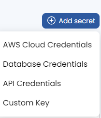
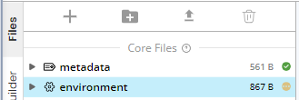
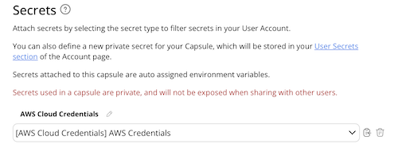

# MLflow Example Model

This capsule is intended to show the functionality of the MLflow Orchestrator Capsule. Multiple different capsules producing machine learning models can all update the same MLflow database and be viewed from the central "Orchestrator" capsule in an interactive cloud workstation. 

This example model is based on [the mlflow tutorial](https://github.com/mlflow/mlflow/tree/master/examples/sklearn_elasticnet_diabetes) which trains an ElasticNet regression model for predicting diabetes progression.

You will need to attach AWS Cloud Credentials as a secret in the environment of this capsule. These credentials must be able to both **Read** and **Write** to the S3 artifact bucket. In order to do this:

1. Go to the "Account" window and choose "User Secrets." Add one "AWS Cloud Credentials" secret: 

2. Navigate to the "Files" tab and select "environment": 

3. Attach the appropriate AWS credentials to the capsule: 

This capsule performs the following steps

1. MLflow searches for an experiment named `capsule_$CO_CAPSULE_ID` (`$CO_CAPSULE_ID` is based on the capsule id in metadata, see User Guide for more information on capsule environment variables.)

2. If the experiment is found, add a new model version otherwise create the experiment and store the artifacts in the specified S3 bucket. 

3. Generate model and use MLflow to log input parameters `alpha` and `l1_ratio` along with `RMSE` and other QC metrics

This capsule is set up in order to remotely store artifacts and experiment information using S3. There are a number of different database backends and possible setups for MLflow, available in their documentation.

## App Panel Parameters

alpha
- alpha parameter for ElasticNet model (from [sklearn.linear_model](https://scikit-learn.org/stable/modules/generated/sklearn.linear_model.ElasticNet.html#sklearn.linear_model.ElasticNet))

l1_ratio
- l1_ratio parameter for ElasticNet model

Input Data
- Input dataset of red wine data. Original found [here](https://scikit-learn.org/stable/modules/generated/sklearn.datasets.load_diabetes.html)

## Outputs

**ElasticNet-paths.png** 
- -Log(alpha) vs coefficients (example artifact) 

[Code Ocean](https://codeocean.com/) is a cloud-based computational platform that aims to make it easy for researchers to share, discover, and run code.  

